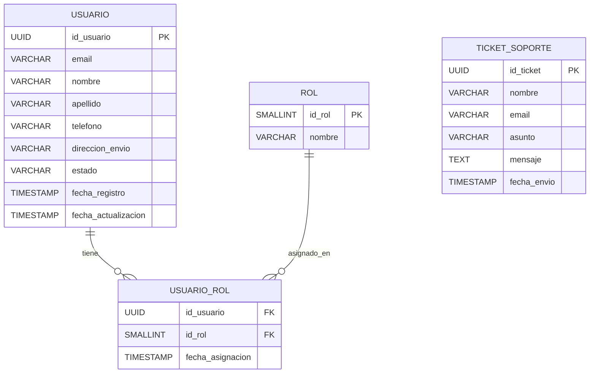
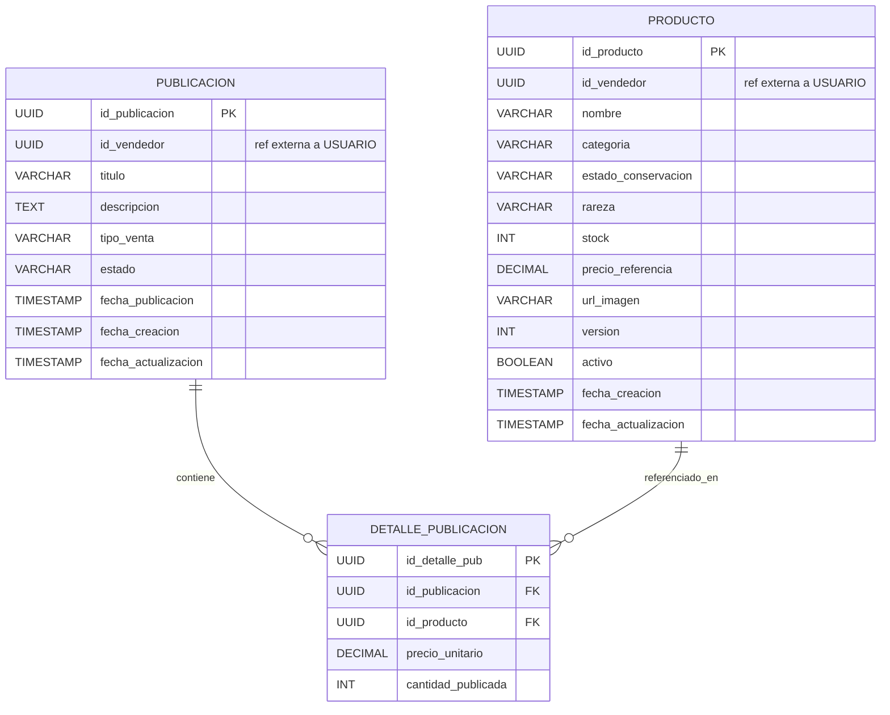
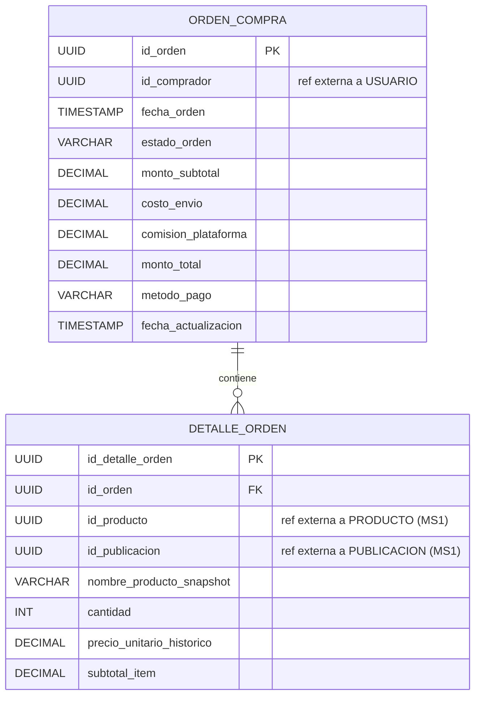
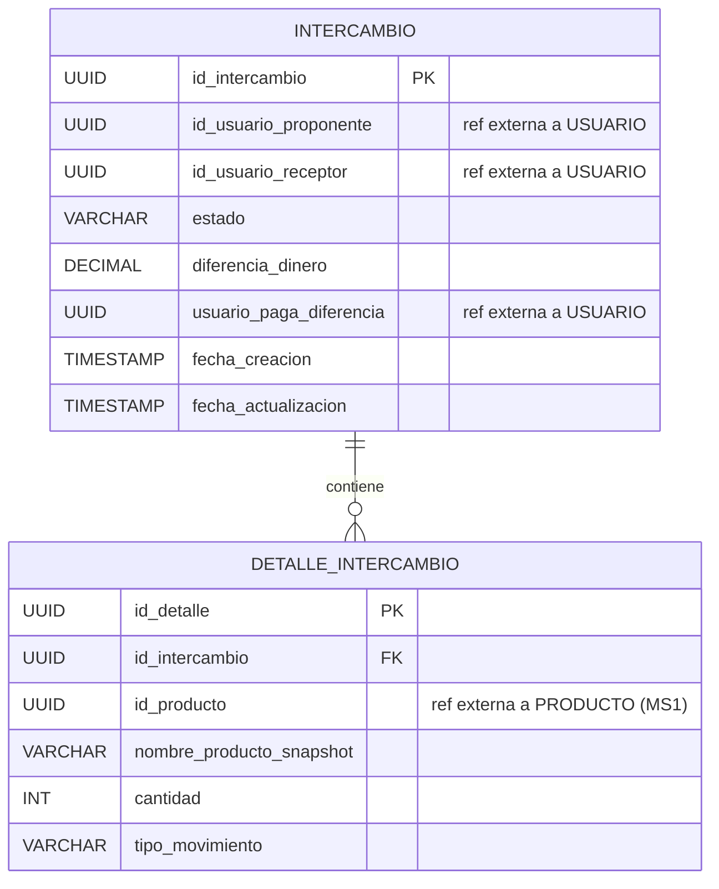

Documentacion openapi generator
- https://www.baeldung.com/java-openapi-generator-server 

## Modelado de base de datos

### Servicio de Identidad

### MS1 - Catálogo

### MS2 - Órdenes / Compras

### MS3 - Intercambios

